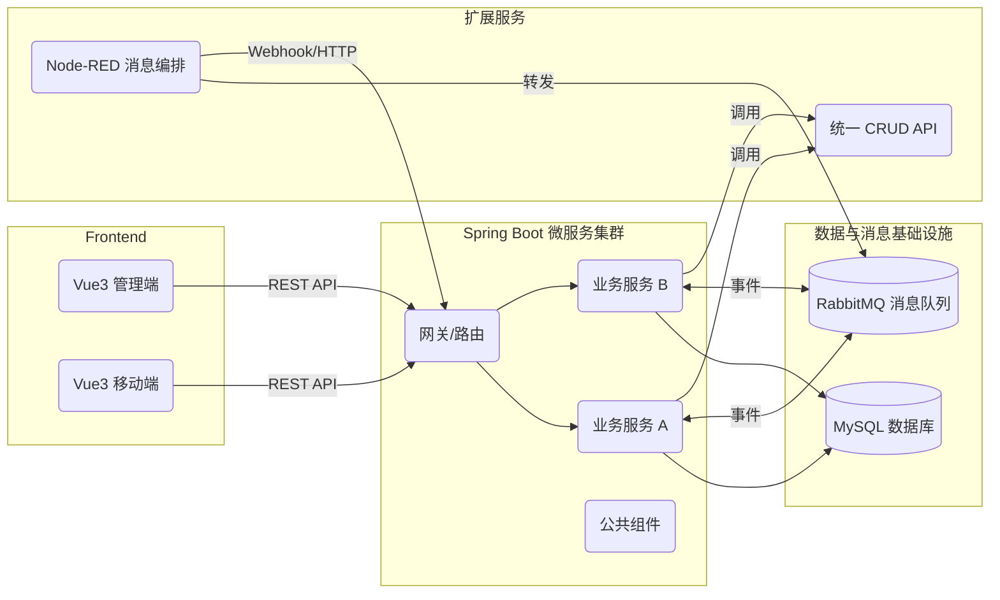

# 课题发布与成员招募系统 — Starter Repo (S2)
技术栈：后端 Spring Boot (Java) | 前端 Vue3 (Vite) | Node 工具链
教学目标：配合“软件工程实践”课程双迭代（原型 5 周，消息与看板 4 周），包含 Scrum 看板、Issue/PR 模板等。

目录说明：
- docs/              课程文档模板（Vision, SRS, Design）
- backend/           后端初始化骨架（Spring Boot 占位）
- frontend/          前端初始化骨架（Vue3 占位）
- .github/           GitHub workflows, ISSUE/PR 模板

> 本仓库为教学模板：各模块以示例/占位为主，学生需要在课程迭代中实现课题功能。

下面是面向大三学生、详尽且教学友好的 README (Markdown)，用于在 GitHub Classroom 中说明如何克隆并在本地搭建、调试、打包运行你们的 LabLink（课题发布系统） 原型。内容覆盖前后端组件、IDE 选择、配置修改、编译打包与联调步骤。你可以直接把它放到仓库根目录的 README.md。

---

## LabLink — 本地搭建与开发指南

目标读者：大三学生（课程实训）  
本文档说明如何从源码启动完整的开发环境（frontend: ms + h5，backend: Spring Boot microservices），以及依赖服务（MySQL、RabbitMQ、Strapi、Node-RED）。按步骤执行即可完成联调。

---

### 系统架构示意

项目整体采用前后端分离 + 微服务的典型模式，依赖多种可复用的支撑组件。下方用 mermaid 描述端到端的核心交互路径，帮助你在开始前建立系统全貌：



在后续各章节中，我们会沿着该图的链路为你提供配置、编译、部署的详细步骤。

⸻

## 目录
- [前置准备](#前置准备)
- [仓库结构说明](#仓库结构说明示例)
- [一、克隆代码](#一克隆代码)
- [二、后端（Java / Spring Boot）搭建与运行](#二后端java--spring-boot搭建与运行)
  - [1) 环境与 IDE 推荐](#1-环境与-ide-推荐)
  - [2) 数据库 MySQL 准备](#2-数据库-mysql-准备)
  - [3) RabbitMQ 准备](#3-rabbitmq-准备)
  - [4) Strapi（统一 CRUD 接口）准备](#4-strapi统一-crud-接口准备)
  - [5) Node-RED（消息封装转发）准备](#5-node-red消息封装转发准备)
  - [6) 后端配置文件说明与运行](#6-后端配置文件说明与运行)
- [三、前端（Vue ms / h5）搭建与运行](#三前端vue-ms--h5搭建与运行)
  - [1) 环境与 IDE 推荐](#1-环境与-ide-推荐-1)
  - [2) 配置（API 地址 / env）](#2-配置api-地址--env)
  - [3) 启动开发服务器 & 打包](#3-启动开发服务器--打包)
- [四、本地联调与测试](#四本地联调与测试)
- [五、生产打包与发布（简要）](#五生产打包与发布简要)
- [六、常见问题与排查](#六常见问题与排查)
- [七、代码贡献与作业提交说明](#七代码贡献与作业提交说明)
- [附录：示例配置片段与命令速查](#附录示例配置片段与命令速查)
- [参考资料推荐](#参考资料推荐)
- [Docker Compose 一键启动示例（推荐）](#docker-compose-一键启动示例推荐)
- [最后（教学提示）](#最后教学提示)

---

## 前置准备

请在开始前准备好以下工具与账号：
- 操作系统：macOS / Linux / Windows (WSL2 推荐)
- Git（建议使用 git 命令行）
- Node.js（推荐 16.x 或 18.x）和 npm/yarn
- Java JDK 11 或 17（以 JAVA_HOME 生效为准）
- Maven（若使用 IDE 内置 Maven，可不单装）
- MySQL（推荐 8.x）或 Docker
- RabbitMQ 或 Docker
- Strapi（Node.js 运行）
- Node-RED（Node.js 运行或 Docker）
- 推荐 IDE：IntelliJ IDEA（Community 或 Ultimate）用于后端；VS Code 用于前端与 Node-RED/Strapi
- 可选：Docker & Docker Compose（用于快速启动 DB / MQ / Strapi / Node-RED）

---

## 仓库结构说明（示例）

/ (repo root)
├─ frontend/
│  ├─ ms/           # Vue MS 客户端（管理端）
│  └─ h5/           # Vue H5 客户端（移动端）
├─ backend/
│  ├─ service-a/    # Spring Boot 微服务 A
│  ├─ service-b/    # Spring Boot 微服务 B
│  └─ common-lib/
├─ strapi/          # Strapi 项目（可选）
├─ node-red/        # Node-RED flows / 导入文件
└─ docker-compose.yml   # （可选）快速启动 mysql、rabbitmq、strapi、node-red

具体路径以你仓库实际结构为准，上述是常见约定。请在开始前查看项目根目录 ls/dir，熟悉模块名称。

---

## 一、克隆代码

在终端中执行（替换为你的仓库地址）：

# 克隆整个课堂仓库到本地
git clone https://github.com/<your-org>/<lablink-repo>.git
cd lablink-repo

如果仓库很大，考虑只克隆子模块或浅克隆（--depth 1）。

---

## 二、后端（Java / Spring Boot）搭建与运行

后端为若干 Spring Boot 微服务（RESTful），使用 Maven 管理。

### 1) 环境与 IDE 推荐
- Java JDK 11/17（`java -version` 检查）
- IntelliJ IDEA：导入 Maven 项目 → File → Open → 选择 `backend/` 下的 `pom.xml`（或多模块父 POM）
- Spring Tool Suite（STS）适合入门，提供针对 Spring 的向导与模板
- VS Code + Java 插件也可，但 IntelliJ 对 Spring 支持较好

### 2) 数据库 MySQL 准备

**方法 A：本地安装 MySQL**

创建数据库与用户（示例）：

```
CREATE DATABASE lablink DEFAULT CHARSET utf8mb4 COLLATE utf8mb4_general_ci;
CREATE USER 'lablink'@'%' IDENTIFIED BY 'lablink_password';
GRANT ALL PRIVILEGES ON lablink.* TO 'lablink'@'%';
FLUSH PRIVILEGES;
```

**方法 B：使用 Docker Compose（推荐课程快速启动）**

在仓库根目录放置或使用已有 `docker-compose.yml`，示例片段：

```yaml
version: "3.8"
services:
  mysql:
    image: mysql:8.0
    container_name: lablink-mysql
    environment:
      MYSQL_ROOT_PASSWORD: rootpwd
      MYSQL_DATABASE: lablink
      MYSQL_USER: lablink
      MYSQL_PASSWORD: lablink_password
    ports:
      - "3306:3306"
    volumes:
      - mysql-data:/var/lib/mysql

  rabbitmq:
    image: rabbitmq:3-management
    container_name: lablink-rabbitmq
    environment:
      RABBITMQ_DEFAULT_USER: guest
      RABBITMQ_DEFAULT_PASS: guest
    ports:
      - "5672:5672"
      - "15672:15672" # 管理界面

volumes:
  mysql-data:
```

启动：

```bash
docker-compose up -d mysql rabbitmq
# 检查容器日志
docker-compose logs -f mysql
```

### 3) RabbitMQ 准备
- 若使用 Docker Compose，容器上 5672（AMQP）与 15672（管理）端口已暴露。
- 访问 RabbitMQ 管理界面：http://localhost:15672（默认 guest/guest）

### 4) Strapi（统一 CRUD 接口）准备

Strapi 通常是一个 Node.js 项目，负责暴露通用内容模型的 CRUD API。

在 `strapi/` 目录操作：

```bash
cd strapi
# 安装依赖
npm install
# 启动开发模式（首次会要求数据库配置）
npm run develop
# 或生产模式
npm run start
```

Strapi 会要求填写数据库连接（可使用 lablink MySQL 或独立 DB），也可以将 Strapi 指向同一 MySQL 或另一个 DB。

注意：若使用 Strapi 连接 MySQL，请在 `config/database.js` 或 `.env` 中填写连接信息。

### 5) Node-RED（消息封装/转发）准备

Node-RED 可用于消息加工、调用后端 API、转发 RabbitMQ 等。

启动 Node-RED：

```bash
# 全局安装（若未安装）
npm install -g node-red

# 启动（项目中可包含 flow export/import）
cd node-red
node-red
# 访问 http://localhost:1880 导入 flows.json
```

如果在 Docker Compose 中，可以添加 `node-red` 服务并挂载 `node-red/flows.json`。

### 6) 后端配置文件说明与运行

Spring Boot 各微服务通常在 `src/main/resources/application.yml` 或 `application.properties` 中读取数据库、RabbitMQ、Strapi 地址等配置。建议在项目中使用 `application-dev.yml` 或通过环境变量覆盖。

> 操作提示：
> - 建议复制维护一份 `application-example.yml`（或 `.env.example`）并添加到版本控制，以便团队成员快速对齐配置项。
> - 本地调试时，可在 IDE Run Configuration 中设置 `SPRING_PROFILES_ACTIVE=dev`，并开启“Allow parallel run”以便观测多个服务日志。
> - 若使用 Docker 容器化服务，优先通过环境变量覆盖敏感信息，避免直接写入配置文件。

示例 `application.properties`（最小示例）：

```
spring.datasource.url=jdbc:mysql://localhost:3306/lablink?useUnicode=true&characterEncoding=utf8&serverTimezone=UTC
spring.datasource.username=lablink
spring.datasource.password=lablink_password
spring.datasource.driver-class-name=com.mysql.cj.jdbc.Driver

spring.rabbitmq.host=localhost
spring.rabbitmq.port=5672
spring.rabbitmq.username=guest
spring.rabbitmq.password=guest

# Strapi API 地址（示例）
strapi.api.base-url=http://localhost:1337/api
```

在 IntelliJ 中运行微服务：
- 将项目作为 Maven 多模块导入，等待依赖下载完成
- 配置 Run/Debug Configurations：选择对应主类（`@SpringBootApplication`），设置 Program arguments/VM options（若需）
- 在 Run Config 中加入环境变量（如 `SPRING_PROFILES_ACTIVE=dev`）
- 运行服务并观察控制台日志，确认 `Tomcat started on port`（默认 8080 或服务自身配置端口）

Maven 命令行运行：

```bash
# 编译
mvn clean package -DskipTests

# 运行（直接运行 jar）
java -jar target/service-a-0.0.1-SNAPSHOT.jar

# 或使用 spring-boot:run （开发时）
mvn spring-boot:run -Dspring-boot.run.profiles=dev
```

如果是微服务，检查每个服务的端口配置，避免冲突（如 8080/8081/8082 等）。

---

## 三、前端（Vue ms / h5）搭建与运行

前端分为两个客户端：ms（管理端）和 h5（移动端），均基于 Vue。

### 1) 环境与 IDE 推荐
- Node.js 16.x 或 18.x（`node -v`）
- npm 或 yarn
- 推荐编辑器：VS Code（安装 Vetur / Volar、ESLint、Prettier）
- WebStorm 提供更完整的 Vue/TypeScript 智能提示和重构能力，适合希望“一站式”体验的同学

### 2) 配置（API 地址 / env）

前端通常读取 `.env.development` / `.env.production` 或 `config/index.js` 来配置后端 base API。

示例 `.env.development`：

```
VUE_APP_API_BASE_URL=http://localhost:8080/api
VUE_APP_STRAPI_URL=http://localhost:1337
VUE_APP_NODE_RED_URL=http://localhost:1880
```

关键点：
- `VUE_APP_API_BASE_URL` 指向后端微服务网关或具体服务（如 http://localhost:8080）
- 若后端开启了 CORS，前端可直接访问；否则需要在后端开启 CORS 或前端代理（`devServer proxy`）

开发时前端代理（`vue.config.js` 示例）：

```javascript
module.exports = {
  devServer: {
    proxy: {
      '/api': {
        target: 'http://localhost:8080',
        changeOrigin: true,
        pathRewrite: { '^/api': '/api' }
      }
    }
  }
}
```

### 3) 启动开发服务器 & 打包

在 `frontend/ms`：

```bash
cd frontend/ms
npm install
npm run serve      # 本地开发（通常访问 http://localhost:8081）
# 打包生产
npm run build
```

在 `frontend/h5`：

```bash
cd frontend/h5
npm install
npm run serve      # 本地访问 http://localhost:8082
npm run build      # 生成 dist，用于部署
```

`serve` 命令端口可能在 `package.json` 或 `vue.config.js` 中定义，注意避免端口冲突。

---

## 四、本地联调与测试

### 1) 启动顺序建议（本地联调）
1. 启动 MySQL + RabbitMQ（或 `docker-compose up -d`）
2. 启动 Strapi（如需）
3. 启动 Node-RED（如需）
4. 启动后端各微服务（按依赖顺序）
5. 启动前端客户端（ms、h5）

> 操作提示：
> - 每新增一个组件，先访问其“健康检查”或管理页面确认成功，再启动依赖它的服务。
> - 对于前端，建议开启浏览器 DevTools 的 `Preserve log`，方便跨域或认证问题排查。
> - 若需要重置数据库，可以结合 `docker-compose down -v` 或 MySQL CLI 清空数据。

### 2) 建议的开发与调试顺序
1. 从最小闭环需求开始（例如报名流程）：先只启动必要的后端服务与 MySQL。
2. 前端本地开发时使用 mock / Strapi 数据源，待 UI 稳定后切换真实后端接口。
3. 引入 RabbitMQ、Node-RED 场景时，第一阶段使用最少的队列与交换机，确认消息走通；第二阶段再补充重试、死信队列等配置。
4. 每个 Sprint 在 `dev` 分支合并后进行一次端到端回归，使用 Postman Collection 或 Newman 自动化验证主要 API。
5. 保持 README/文档同步更新运行端口、测试账号、环境变量说明。

### 3) 常用联调检查点
- 后端服务日志：确认连接到 MySQL 成功、RabbitMQ 连接成功、端口监听
- 使用 curl 或 Postman 测试后端健康检查：

```bash
# 示例
curl http://localhost:8080/actuator/health
# 或自定义健康端点
curl http://localhost:8080/api/v1/health
```

- 测试数据库表是否初始化：登录 MySQL 检查 `SHOW TABLES` 或查看 Flyway / Liquibase migration 日志（若使用）
- 测试消息流：访问 RabbitMQ UI（http://localhost:15672）查看 exchanges/queues，或在 Node-RED 中调试 flows
- 在前端页面上进行操作（报名），观察后端是否收到请求并写入 DB 或发送消息到 MQ

### 4) 调试技巧
- 在 IntelliJ 中为后端设置断点，使用 Debug 模式逐步跟踪请求
- 前端使用浏览器开发者工具查看网络请求（Network）与控制台错误
- 若前端跨域问题（CORS），在后端允许特定源或使用 `@CrossOrigin` 注解在 Controller 层临时允许

---

## 五、生产打包与发布（简要）
- 后端：使用 `mvn clean package` 生成 fat jar 或 dockerize（推荐使用 Dockerfile）
- 前端：`npm run build`，将 `dist/` 上传到静态服务器（Nginx）
- 推荐使用 Docker Compose / Kubernetes 将所有服务容器化并统一编排
- 持续集成：建议配置 GitHub Actions（或 GitLab CI）自动构建/测试/部署

---

## 六、常见问题与排查

> 操作提示：遇到异常时先查看最近改动组件的日志或容器状态，再结合下表定位问题。

**Q1：后端启动报错 `Communications link failure`**  
- 原因：MySQL 未启动或连接信息错误。  
- 解决：检查 MySQL 容器/服务是否运行，核对 `application.properties` 中的 URL/账号/密码。

**Q2：RabbitMQ 连接失败或提示 `ACCESS_REFUSED`**  
- 原因：端口/用户名/密码不正确或服务未运行。  
- 解决：检查 `spring.rabbitmq.*` 配置，访问 http://localhost:15672 验证；若使用自定义用户，确保已授予权限。

**Q3：前端请求被阻止（CORS 或 HTTPS 混合内容）**  
- 解决：在后端开启 CORS 或在前端 devServer 配置代理；部署到 HTTPS 时同时提供 HTTPS API 或配置反向代理。

**Q4：Strapi 启动报 DB 连接失败**  
- 解决：检查 Strapi 的 `config/database.js` 或 `.env`，确认 MySQL 权限允许外部连接；首次启动可临时使用 SQLite 减少依赖。

**Q5：Node-RED 流程不工作**  
- 解决：在 Node-RED 编辑器中导入 flows，使用 Debug 节点观察消息经过情况；确认 RabbitMQ 队列名称、Host 与凭据一致。

**Q6：Vue 构建失败（如 `ERR_OSSL_EVP_UNSUPPORTED` 或 `node-sass` 编译错误）**  
- 解决：升级 Node.js 到 LTS（16/18），清理 `node_modules` 后重新安装；必要时改用 `sass` 依赖替代。

**Q7：Maven 下载依赖缓慢或失败**  
- 解决：配置国内镜像源（如阿里云 Maven），或将常用依赖缓存到校内 Nexus/Artifactory，再通过 `~/.m2/settings.xml` 指定。

---

## 七、代码贡献与作业提交说明
- 开发分支约定：
  - `main` / `master`：稳定版本（不直接提交作业代码）
  - `dev`：组级集成分支
  - 每个小组或同学请创建 feature 分支：`feature/<学号>-<功能>` 并发起 Pull Request
- 提交说明（commit message）：
  - `feat: add ...` / `fix: ...` / `docs: ...`
- 作业提交：
  - 通过 GitHub Classroom 课堂页面进行仓库提交/评分；作业要求见课程附件
  - 请务必在 README 中标注你实现的功能、运行端口与特殊配置

---

## 附录：示例配置片段与命令速查

**MySQL 创建命令**

```
CREATE DATABASE lablink DEFAULT CHARSET utf8mb4;
CREATE USER 'lablink'@'%' IDENTIFIED BY 'lablink_password';
GRANT ALL ON lablink.* TO 'lablink'@'%';
FLUSH PRIVILEGES;
```

**后端 application.properties 最小模板**

```
spring.datasource.url=jdbc:mysql://localhost:3306/lablink?useSSL=false&serverTimezone=UTC
spring.datasource.username=lablink
spring.datasource.password=lablink_password

spring.rabbitmq.host=localhost
spring.rabbitmq.port=5672
spring.rabbitmq.username=guest
spring.rabbitmq.password=guest

server.port=8080
```

**常用 Maven 命令**

```
mvn clean package -DskipTests
mvn spring-boot:run
```

**常用 NPM 命令（frontend）**

```
npm install
npm run serve   # 开发
npm run build   # 生产打包
```

---

## 参考资料推荐
- Spring Boot 官方文档：https://docs.spring.io/spring-boot/docs/current/reference/html/
- MySQL 8.0 参考手册：https://dev.mysql.com/doc/refman/8.0/en/
- RabbitMQ 官方教程：https://www.rabbitmq.com/tutorials/
- Vue 3 官方文档：https://cn.vuejs.org/guide/introduction.html
- Vite 官方文档：https://vitejs.dev/guide/
- Strapi 文档：https://docs.strapi.io/
- Node-RED 文档：https://nodered.org/docs/
- Docker Compose 文档：https://docs.docker.com/compose/

---

## Docker Compose 一键启动示例（推荐）

以下示例选用 Docker Compose 启动 MySQL、RabbitMQ、Strapi、Node-RED 以及一个示例后端服务。请根据实际服务端口和镜像调整。

```yaml
version: "3.9"

services:
  mysql:
    image: mysql:8.0
    container_name: lablink-mysql
    command: --default-authentication-plugin=mysql_native_password
    environment:
      MYSQL_ROOT_PASSWORD: rootpwd
      MYSQL_DATABASE: lablink
      MYSQL_USER: lablink
      MYSQL_PASSWORD: lablink_password
    ports:
      - "3306:3306"
    volumes:
      - mysql-data:/var/lib/mysql
    healthcheck:
      test: ["CMD", "mysqladmin", "ping", "-h", "localhost"]
      interval: 10s
      timeout: 5s
      retries: 5

  rabbitmq:
    image: rabbitmq:3-management
    container_name: lablink-rabbitmq
    ports:
      - "5672:5672"
      - "15672:15672"
    healthcheck:
      test: ["CMD", "rabbitmq-diagnostics", "status"]
      interval: 10s
      timeout: 5s
      retries: 5

  strapi:
    image: strapi/strapi
    container_name: lablink-strapi
    depends_on:
      mysql:
        condition: service_healthy
    environment:
      DATABASE_CLIENT: mysql
      DATABASE_NAME: lablink
      DATABASE_HOST: mysql
      DATABASE_PORT: 3306
      DATABASE_USERNAME: lablink
      DATABASE_PASSWORD: lablink_password
    ports:
      - "1337:1337"
    volumes:
      - ./strapi:/srv/app

  node-red:
    image: nodered/node-red
    container_name: lablink-node-red
    ports:
      - "1880:1880"
    volumes:
      - ./node-red:/data

  backend-service:
    build:
      context: ./backend/service-a
      dockerfile: Dockerfile
    container_name: lablink-service-a
    depends_on:
      mysql:
        condition: service_healthy
      rabbitmq:
        condition: service_healthy
    environment:
      SPRING_DATASOURCE_URL: jdbc:mysql://mysql:3306/lablink?characterEncoding=utf8&serverTimezone=UTC
      SPRING_DATASOURCE_USERNAME: lablink
      SPRING_DATASOURCE_PASSWORD: lablink_password
      SPRING_RABBITMQ_HOST: rabbitmq
      SPRING_RABBITMQ_PORT: 5672
    ports:
      - "8080:8080"

volumes:
  mysql-data:
```

> 操作提示：
> - 执行 `docker-compose up -d` 启动所有服务，首次构建镜像可能耗时较长。
> - 使用 `docker-compose logs -f backend-service` 观察后端日志；如容器重启，可用 `docker-compose ps` 排查退出码。
> - 可结合 `.env` 文件提供敏感参数（如数据库密码、JWT 秘钥），避免硬编码进 Compose 文件。

---

## 最后（教学提示）
- 初次启动建议按步骤逐项检查：DB → MQ → Strapi → Node-RED → Backend → Frontend
- 遇到问题先看日志（后端、Strapi、Node-RED、Docker 容器日志）再排查
- 作业中鼓励将某个模块容器化（Dockerfile + docker-compose），作为实践任务之一
- 有需要我可以：
  - 生成一个 `docker-compose.yml` 完整示例（包含 MySQL/RabbitMQ/Strapi/Node-RED + 后端服务示例）
  - 或者把上述 README 转成 Notion-friendly 文档块

---
