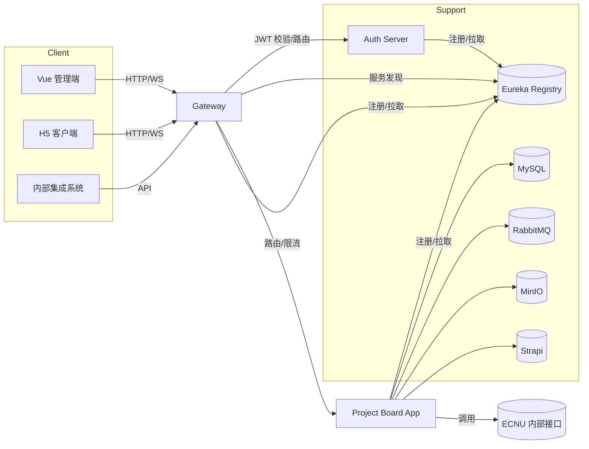

# LabLink Backend 微服务体系

LabLink 后端采用 Spring Boot + Spring Cloud Hoxton 的微服务架构，结合网关、认证、注册中心以及业务服务实现前后端分离。该目录下包含所有后端微服务与公共类库，是前端 `project-board-ms`、`project-board-client` 的核心依赖。

---

## 架构总览

核心组件包括：

- `commons-java`：跨服务复用的工具库（Bean 更新、Rest 响应封装、校验等）。
- `ecnu-service-registry-center`：Eureka 服务注册中心，负责服务发现与健康监测。
- `ecnu-auth-server`：统一认证中心，基于 Spring Security OAuth2 + JWT。
- `ecnu-gateway`：Zuul 网关，负责外部流量入口、路由、熔断与跨域。
- `project-board-app`：业务聚合服务，暴露项目管理、成员招募等 REST API。

整体微服务拓扑如下：



> **推荐启动顺序**：`commons-java (install)` → `ecnu-service-registry-center` → `ecnu-auth-server` → `project-board-app` → `ecnu-gateway` → 前端客户端。

---

## 组件说明

### `commons-java`
- **定位**：公共工具库，封装 Rest 响应体、Bean 更新器、MapBuilder、验证器等常用能力。
- **使用方式**：在其他模块 `pom.xml` 中引入 `com.cloume.common:commons-java`，或在本地执行 `mvn clean install` 后直接引用 SNAPSHOT。
- **目录亮点**：
  - `beanutils`：面向 Map → Bean 更新场景的 `Updater`。
  - `rest`：统一的 `RestResponse`、`PagingRestResponse`。
  - `verify`：链式校验器，支持正则与自定义检查器。

### `ecnu-service-registry-center`
- **作用**：Eureka Server，承担实例注册、心跳维护、下线剔除。
- **默认端口**：`9360`（见 `application.yml`）。
- **启动**：
  ```bash
  cd backend/ecnu-service-registry-center
  ./mvnw spring-boot:run
  ```
- **配置要点**：`application-dev.yml` 中已调整缓存刷新频率（3s），开发环境默认自注册，方便本地集群测试。

### `ecnu-auth-server`
- **作用**：OAuth2 认证服务器，支持企业微信扫码、统一身份认证跳转、用户名密码登录，发放 JWT。
- **打包方式**：`war`，可用 Spring Boot 内置容器运行（`mvnw spring-boot:run`）或部署至外部 Tomcat。
- **端口 & 配置**：默认端口 `8398`（见 `application-dev.yml`），`users.json` 与 `roles-*.json` 提供初始账号与角色。`WX`、`OAuth` 参数可在 `application-dev.yml` 调整。
- **辅助脚本**：`scripts/start.sh`、`start.bat` 提供快速启动示例。

### `ecnu-gateway`
- **作用**：Zuul 网关，统一对外暴露 `/app/**`、`/auth/**` 等路由，承担跨域、Header 透传、超时控制。
- **默认端口**：`8360`。
- **配置要点**：
  - `zuul.routes` 中维护各微服务的路由及 Strip 规则。
  - `ribbon`、`hystrix` 区块定义转发超时与熔断策略。
  - CORS 白名单可通过 `cors.allowedUrl` 设置。

### `project-board-app`
- **作用**：业务核心服务，提供项目看板、成员招募、文件导出、外部数据同步等 REST API。
- **默认端口**：`8924`。
- **关键依赖**：
  - 数据库：MySQL（`spring.datasource`）。
  - 消息队列：RabbitMQ（文件导出、用户消息通知）。
  - 对象存储：MinIO（文件上传、模板管理）。
  - 第三方：Strapi（内容管理）、ECNU 内部 API（人员/院系数据）、Superset（报表数据）。
  - 认证：依赖 `ecnu-auth-server` 发放的 JWT。
- **目录亮点**：
  - `controller`：REST API。包括文件导出、数据同步、用户管理、Strapi 代理等。
  - `service`：封装业务逻辑与外部调用（如 `BasisInfoCenterService`、`ExternalDataService`）。
  - `message`：RabbitMQ 消费者（文件导出完成通知等）。
  - `config`：Swagger/OpenAPI、RabbitMQ、定时任务、JSON 配置映射。
  - `repository`：Spring Data JPA 仓储，监听器处理事件。
- **开发提示**：`application-dev.yml` 中存放所有外部依赖地址，首次克隆后需替换数据库、MQ、MinIO 等连接信息。

---

## 开发环境准备

| 类别 | 版本/说明 |
| --- | --- |
| JDK | OpenJDK / Oracle JDK 8（`java.version=1.8`） |
| Maven | 3.6+，推荐使用各模块自带 `mvnw` |
| Spring Boot | 2.2.x / 2.4.x（依模块而定） |
| Spring Cloud | Hoxton SR4 / 2020.0.1 |
| 数据库 | MySQL 5.7+/8.0（需创建业务库并设置账号） |
| 消息队列 | RabbitMQ 3.x（启用管理端口 15672） |
| 对象存储 | MinIO 或兼容 S3 的服务 |
| 其他 | Strapi（内容管理）、Superset（报表）、ECNU OAuth/企业微信配置 |

建议使用 Docker Compose 快速启动 MySQL、RabbitMQ、MinIO、Strapi，具体示例可参考根目录 README。

---

## 本地开发与启动流程

1. **拉取代码 & 初始化公共库**
   ```bash
   git clone <repo>
   cd backend/commons-java
   ./mvnw clean install
   ```

2. **启动基础设施**
   - MySQL：创建数据库（如 `ecnu`），同步账号权限。
   - RabbitMQ：新建虚拟主机 `sei` 和用户。
   - MinIO/Strapi：按 `application-dev.yml` 中的地址调整。

3. **依次启动微服务**
   ```bash
   # Eureka Server
   cd backend/ecnu-service-registry-center
   ./mvnw spring-boot:run

   # Auth Server
   cd ../ecnu-auth-server
   ./mvnw spring-boot:run

   # 业务服务
   cd ../project-board-app
   ./mvnw spring-boot:run

   # 网关
   cd ../ecnu-gateway
   ./mvnw spring-boot:run
   ```
   > 可通过 `http://localhost:9360` 查看注册中心 UI，确认其他服务已注册成功。

4. **前端联调**：在网关 `8360` 端口后，前端通过 `/app/**`、`/auth/**` 等路径访问后端。

---

## 编译、测试与打包

- **全量编译**
  ```bash
  # 在 backend 目录执行
  mvn -pl commons-java,ecnu-service-registry-center,ecnu-auth-server,ecnu-gateway,project-board-app clean package
  ```
  或针对单个模块使用对应 `mvnw`。

- **单元测试**
  ```bash
  ./mvnw test          # commons-java / registry / gateway / app
  ```
  `project-board-app` 默认使用 Spring Boot Test，确保本地已配置测试数据源或使用 `application-test.yml`。

- **部署产物**
  - `ecnu-auth-server`、`ecnu-gateway`：生成可部署的 `war`/`jar`。
  - `project-board-app`、`ecnu-service-registry-center`：生成可执行 `jar`。

---

## 配置管理建议

- 所有服务默认使用 `application-dev.yml`，生产环境可通过 `SPRING_PROFILES_ACTIVE=prd` 切换。
- `application-dev.yml` 中存在敏感信息（数据库密码、OAuth Client Secret 等），**请勿提交到版本库**，建议通过环境变量或外部配置中心覆盖。
- 可使用 Nacos / Spring Cloud Config 进一步集中化配置（当前仓库尚未集成）。

---

## 新同学上手清单

1. 熟悉整体架构与启动顺序，确认各服务端口与依赖。
2. 对照 `project-board-app` 的 Swagger（`/swagger-ui.html`）了解业务接口。
3. 克隆前端仓库，确认网关路由与前端 `.env` 中的 API 前缀一致。
4. 若需新增微服务，优先抽取公共代码到 `commons-java`，并注册至 Eureka + Zuul。
5. 建议在 IDEA 中导入 Maven 多模块工程，使用 `Run Dashboard` 管理多个 Spring Boot 实例。

如需更多协助，可查看各子模块的 `readme.md` 或与维护者沟通。祝开发顺利！